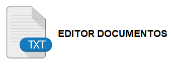
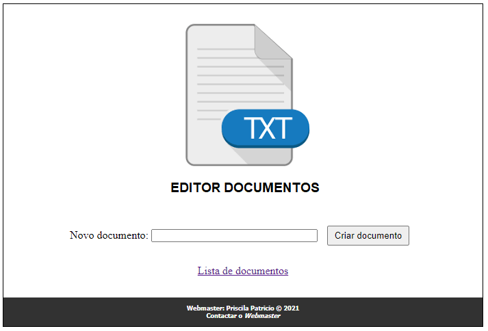

<h1 align="center">
    
</h1>

  <a href="#rocket-tecnologias">Tecnologia</a>&nbsp;&nbsp;&nbsp;|&nbsp;&nbsp;&nbsp;
  <a href="#-projeto">Projeto</a>&nbsp;&nbsp;&nbsp;|&nbsp;&nbsp;&nbsp;
  <a href="#-como-rodar">Como rodar</a>&nbsp;&nbsp;&nbsp;|&nbsp;&nbsp;&nbsp;
  <a href="#-como-contribuir">Como contribuir</a>&nbsp;&nbsp;&nbsp;
  

 

 

  

## Exercício PHP - Construção de Editor Documentos de texto.

## 🚀 Tecnologias

Esse projeto foi desenvolvido com a seguinte tecnologia:

- [Xampp](https://www.apachefriends.org/pt_br/index.html)
- [PHP 8.0.1](https://www.php.net/)

## 💻 Projeto

O Editor Documentos é um ambiente criado para criação e edição de simples documentos de texto.

## 👩🏿‍💻 Como rodar

- Clone o projeto.
- ative o Apache
- acesse http://localhost

## 🤔 Como contribuir

- Faça um fork desse repositório;
- Cria uma branch com a sua feature: `git checkout -b minha-feature`;
- Faça commit das suas alterações: `git commit -m 'feat: Minha nova feature'`;
- Faça push para a sua branch: `git push origin minha-feature`.

Depois que o merge da sua pull request for feito, você pode deletar a sua branch.

